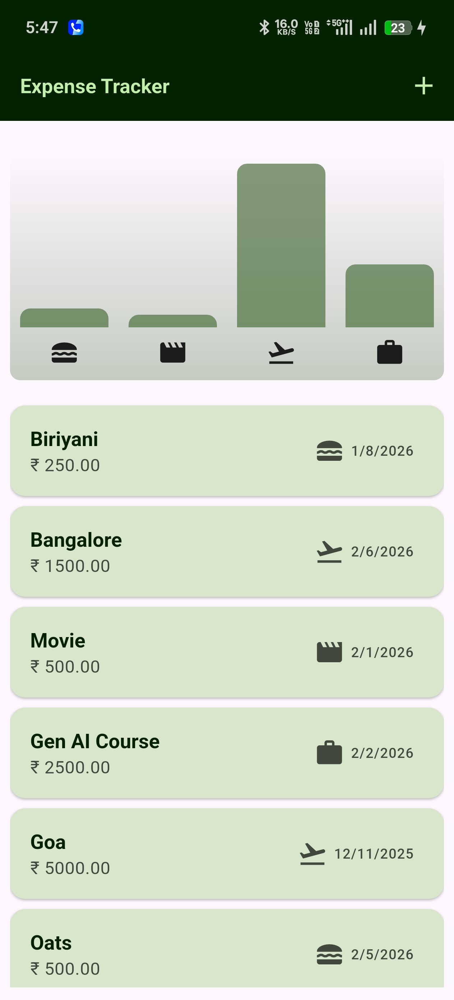
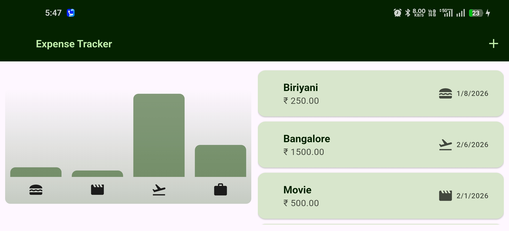
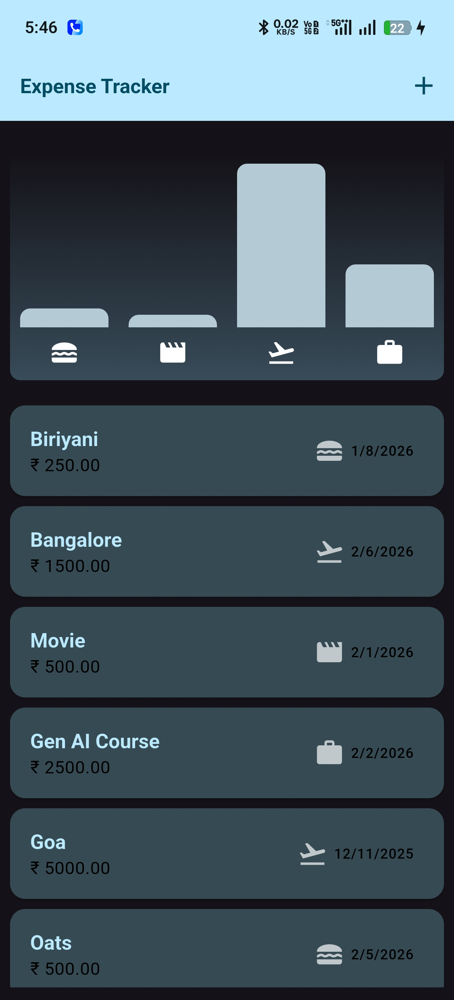
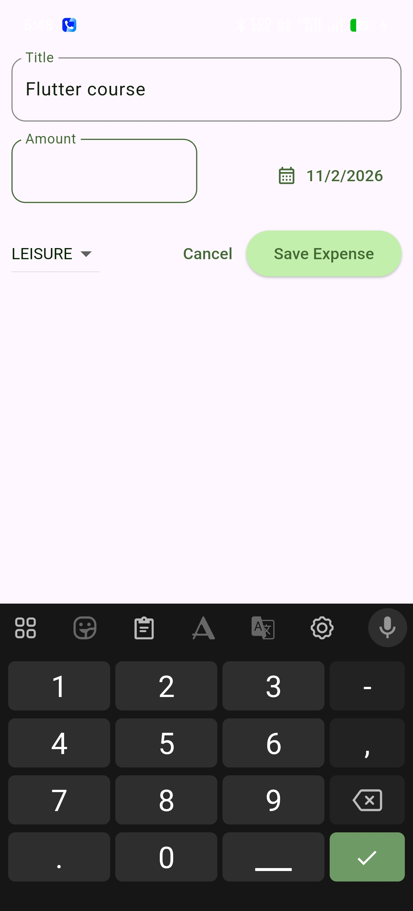
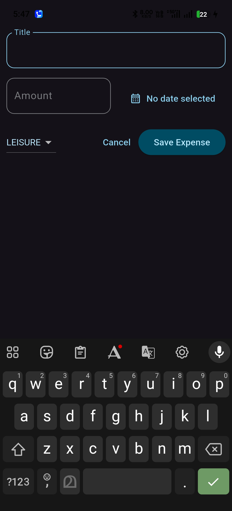

# Flutter Expense Tracker App 💸📱

A clean, focused Flutter expense tracker application demonstrating
state-driven UI updates, responsive layouts, and reusable widget composition.

The project intentionally uses **local state management** where appropriate,
avoiding unnecessary global state to keep the implementation simple,
predictable, and maintainable.

---

## ✨ Features

- Multi-widget home flow with chart + expense list
- Add expense using a bottom sheet form
- Input validation for title, amount, and date
- Category-based expense tracking (`food`, `travel`, `leisure`, `work`)
- Swipe-to-delete with `SnackBar` undo action
- Category-wise expense visualization using a bar chart
- Responsive home layout:
  - Mobile view (`width < 600`): vertical layout
  - Desktop/tablet view (`width >= 600`): side-by-side layout
- Themed UI with light/dark support (`ThemeMode.system`)

---

## 🧱 Architecture & Design Decisions

- **Local State with StatefulWidget**
  - Expense list state is scoped to `HomeScreen`
  - Form interaction state is scoped to `AddExpenseSheet`
  - Avoided global state management to prevent overengineering

- **Explicit state vs derived data separation**
  - Mutable state: registered expense list and current form selections
  - Derived data: per-category totals and chart maximum computed on demand

- **Predictable state updates**
  - Add operation uses list replacement (`[..._registeredExpenses, expense]`)
  - Remove/undo actions are wrapped in `setState` for consistent UI updates

- **Reusable UI components**
  - `ExpenseCard` for list items
  - `Chart` and `ChartBar` for visualization
  - `AddExpenseSheet` for controlled form input

- **Safe UX handling**
  - Defensive form validation before save
  - Date picker boundaries set to recent period
  - Undo support to recover accidental deletes

---

## 🛠 Tech Stack

- Flutter (Material)
- Dart
- intl (date formatting)

---

## 📸 Screenshots

| Home Screen (Mobile) | Home Screen (Desktop) | Dark Theme |
|----------------------|-----------------------|-----------------------|
|  |  | | 

| Add Expense Sheet | Dark Theme |
|-------------------|------------|
|  |  |

---

## 🧠 Key Takeaways

- UI should be rebuilt from state changes, not manual UI mutation
- Keeping state local reduces complexity in small/medium apps
- Derived values should be computed, not redundantly stored
- Responsive layouts can be handled cleanly with width-based branching
- Reusable widgets improve maintainability and readability

---

## 🔮 Possible Enhancements

- Persist expenses locally (SQLite/Hive)
- Add filters (date range/category)
- Add edit-expense capability
- Add unit/widget tests for validation and chart logic
- Add monthly trends and richer analytics

---

## 👨‍💻 Author

**<GOKUL HARI>**  
Software Engineer
